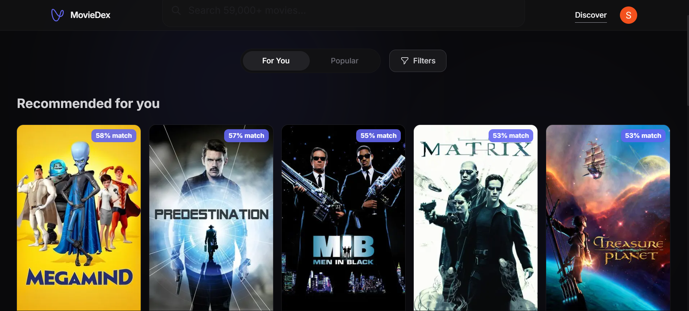
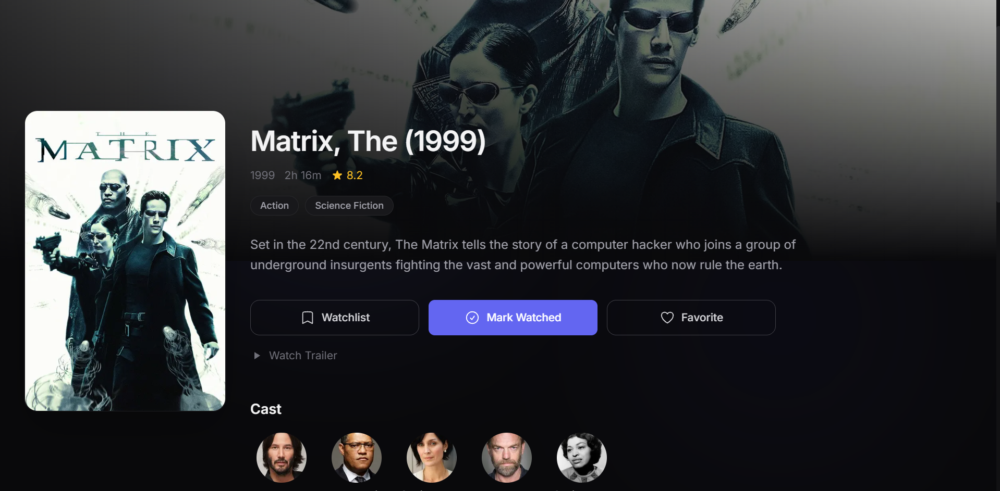
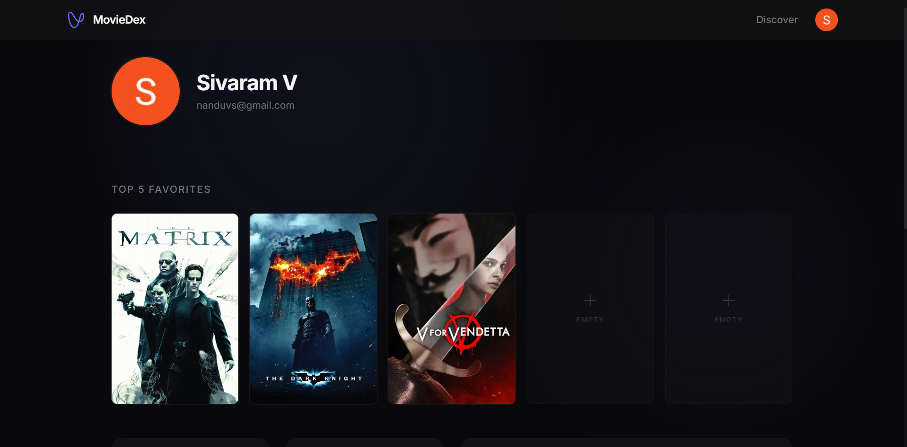
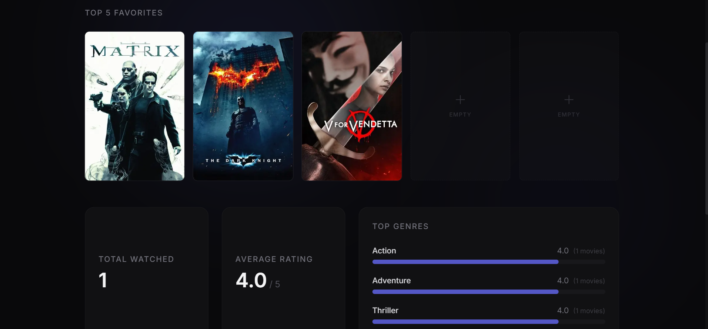
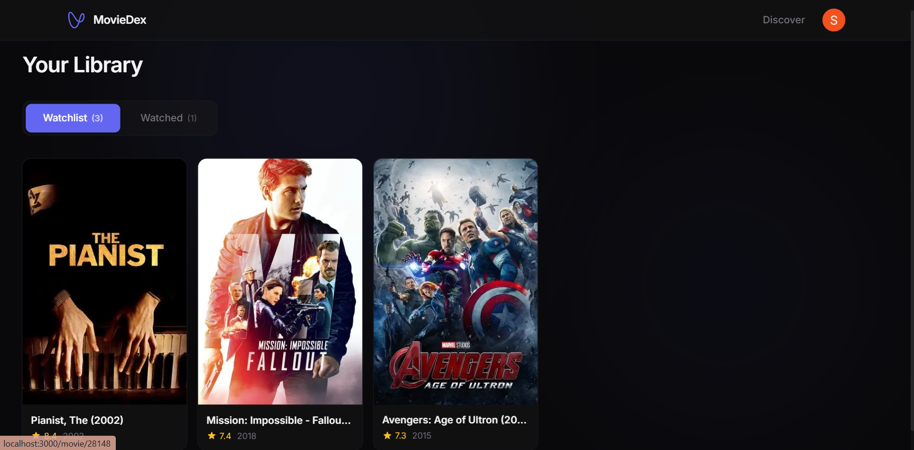

# MovieDex

MovieDex is a highly personalized, AI-powered movie recommendation engine. Built to production-grade standards, it goes beyond simple "popular" or "trending" lists by employing a state-of-the-art **Two-Stage Recommendation Pipeline** with **S-Curve Blending** to truly understand and dynamically adapt to your unique tastes.

## 📸 Application Showcase

  
   

  
  

## 🧠 AI/ML Architecture: Two-Stage Pipeline

MovieDex relies on a modern recommendation pipeline identical in structure to architectures used by large-scale streaming platforms. It is broken into two distinct stages: **Retrieval** and **Ranking**, bridged seamlessly by a dynamic cold-start safety mechanism.

### Stage 1: Retrieval (Two-Tower Architecture)
The goal of the retrieval stage is to rapidly filter down millions of potential movies to a small subset (e.g., top 100) of strong candidates.

* **The Model:** We use a **Two-Tower Neural Network**. One "tower" learns to embed users (based on their watch history, favorites, and ratings), while the other embeds items (movies). 
* **The Execution:** These towers map both users and movies into a shared **64-dimensional vector space**. In production, we don't run the full model for retrieval. Instead, we pre-compute the movie vectors and store them in PostgreSQL. We then use the **`pgvector`** extension to perform ultra-fast Approximate Nearest Neighbor (ANN) search (using negative inner product `<#>`) to retrieve the top-K candidates that match the user's learned embedding.

### Stage 2: Ranking (NeuMF - Neural Matrix Factorization)
The retrieval stage is fast, but coarse. The ranking stage takes the top-K candidates from Stage 1 and meticulously scores them to find the absolute best matches.

* **The Model:** We use an upgraded **NeuMF** (Neural Matrix Factorization) architecture. It combines traditional generalized matrix factorization (GMF) with a wide, stable multi-layer perceptron (MLP layers: `[256, 128, 64]` with `BatchNorm1d`). This allows the model to capture both linear and highly complex non-linear interactions between users and movies.
* **The Execution:** The NeuMF model is exported to **ONNX** and runs seamlessly within the FastAPI backend using `onnxruntime`. The ONNX InferenceSession vectorizes the candidates and re-ranks them in milliseconds.

### 🛡️ "S-Curve" Score Blending (The Cold-Start Solution)
To solve the classic "Cold Start" problem for brand-new users, MovieDex implements a dynamic **S-Curve Blending Algorithm**:
* **New Users ($N \le 10$):** We bypass the Neural Matrix Factorization. Instead, we generate a semantic centroid vector from their onboarding choices and use pure **pgvector** cosine-similarity.
* **Transitioning Users ($10 < N < 40$):** As users build interaction history, the system seamlessly blends the pgvector retrieval scores with the NeuMF ranking predictions using a mathematically smooth Sigmoid (S-Curve) alpha ($\alpha$).
* **Warm Users ($N \ge 40$):** The system fully transitions to the deep-learned NeuMF ranker for hyper-personalized predictions.

### 🔄 Nightly Retraining
The system gets smarter every day. A GitHub Actions workflow (`.github/workflows/nightly-retrain.yml`) triggers an automated nightly retraining job. It pulls the latest user interactions (ratings, watch history, favorites), retrains both the Two-Tower and NeuMF models on the latest data, and hot-swaps the updated weights into production with zero downtime.

---

## 🏗️ Engineering Stack

MovieDex isn't just an ML model; it's a complete, modern web application built for scale and premium user experience.

### Frontend
* **Framework:** Next.js 16 (App Router)
* **Language:** TypeScript
* **Styling:** Tailwind CSS V4
* **Design:** A premium, minimalist UI featuring dynamic ripple backgrounds, seamless light/dark mode harmony, glassmorphism, and optimistic UI updates for instantaneous interactivity.

### Backend
* **Framework:** FastAPI
* **Language:** Python 3.13
* **Inference:** PyTorch (for Two-Tower lookup) & ONNX Runtime (for NeuMF ranking) 
* **Concurrency:** CPU-bound ML inferences (ONNX forward passes, large tensor ops) are safely dispatched to thread pools to ensure the async event loop is never blocked.

### Database
* **Provider:** Supabase
* **Engine:** PostgreSQL
* **Extensions:** `pgvector` for scalable vector similarity search.
* **ORM:** SQLAlchemy (async)

## 🚀 Getting Started

1. Clone the repository
2. Set up the frontend (`cd frontend && npm install && npm run dev`)
3. Set up the backend (`cd backend && python -m venv .venv && .\.venv\Scripts\Activate && pip install -r requirements.txt && uvicorn app.main:app --reload`)
4. Configure your `.env` files based on the `.env.example` templates.
